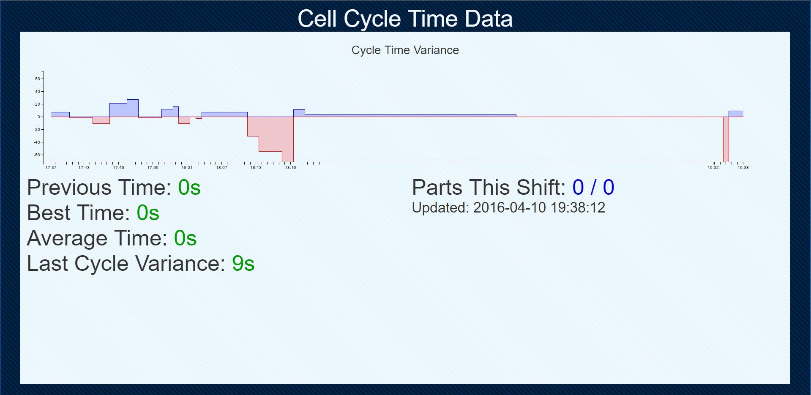

# Node-SCADA-System Standalone Version
* This Repo Is Now Read-Only *
SCADA or MES system.

## Libraries:
	- Node
	- Express
	- [mcprotocol](https://github.com/plcpeople/mcprotocol)
	- [c3.js](http://c3js.org/)
	- [d3.js](https://d3js.org/)



## Setup
- Clone repo
- install [Nodejs](https://nodejs.org/en/)
- cd to to root
- ```$ npm install```
- Change settings in plc.js for the plc and data you wish to collect.
- Modify the index.jade and index.js file for the information you collect.
